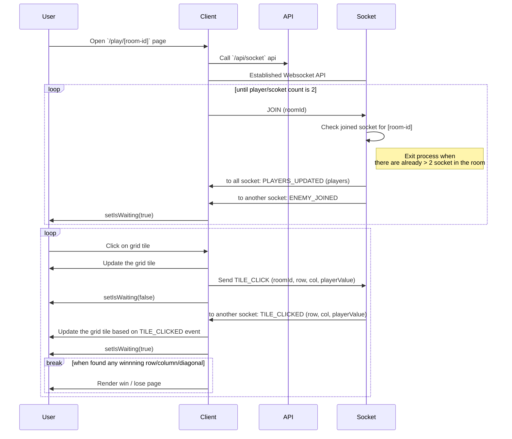

# Ticatoe

## Run The Server

First, run the development server:

```bash
npm run dev
# or
yarn dev
# or
pnpm dev
```

Open [http://localhost:3000](http://localhost:3000) with your browser to see the result.

## Technical Documentation

This is a fullstack Next.js application that use websocket to run a very simple tic-tac-toe games with your friends.

The flow for the play room is something like this.


